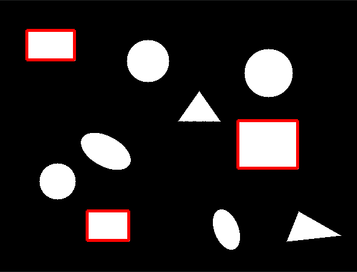

# Rectangle Detection System

A C++ computer vision application that detects rectangles in images using custom image processing algorithms.

Does not use any libraries, just naked C++.

## Demo



## Features

- Custom rectangle detection algorithm
- Real-time image processing
- Interactive terminal interface
- Test image generation with random rectangles
- Rectangle visualization with color coding
- Cross-platform support (Linux, WSL)
- Uses no external libraries

## Project Structure

```
CppRectangleRecognition/
├── Include/
│   └── ShapeDetector/
│       ├── ImageProcessor.h       # Image processing utilities
│       └── RectangleDetector.h    # Rectangle detection algorithms
├── Source/
│   ├── ImageProcessor.cpp         # Image processing implementation
│   ├── Main.cpp                   # Main application
│   └── RectangleDetector.cpp      # Rectangle detection implementation
├── Test/                          # Unit tests
│   ├── TestGeometry.cpp           # Geometry structure tests
│   ├── TestImageProcessor.cpp     # Image processing tests
│   ├── TestMain.cpp               # Test runner
│   ├── TestRectangleDetector.cpp  # Rectangle detection tests
│   └── TestPerformance.cpp        # Performance benchmarks
├── build/                         # Build directory (generated)
├── resources/                     # Demo images and resources
└── CMakeLists.txt                # CMake configuration
```

## Building

### Prerequisites

- CMake 3.10 or higher
- C++17 compatible compiler (GCC, Clang)
- ImageMagick (optional, for PNG conversion)

### Build Instructions

Use scripts:

```bash
$ ./b # just build the project and test
$ ./r # calls b then runs  the app
$ ./v # calls r then opens the result using explorer or equivalent on current platform
```

Or manually:

```bash
$ mkdir build && cd build && cmake .. && make
```

### Running

```bash
cd build
./CppRectangleRecognition
```

## Usage

- Press **SPACE** to generate a new test image with random rectangles
- Press **Q** to quit the application
- Detected rectangles are displayed with:
  - Red outlines showing rectangle boundaries
  - Green dots marking rectangle centers
  - Blue lines indicating rectangle orientation
- Output images are saved as `output.ppm` and converted to `output.png` if ImageMagick is available

## Algorithm Details

The rectangle detection system uses:

1. **Test Image Generation**: Creates synthetic images with rotated rectangles
2. **Edge Detection**: Identifies potential rectangle boundaries
3. **Contour Analysis**: Finds closed contours in the image
4. **Shape Approximation**: Simplifies contours to identify rectangular shapes
5. **Filtering**: Removes false positives based on area and aspect ratio

## Testing

Run the test suite:

```bash
cd build
make test
```

Or run tests directly:

```bash
./tests
```

### Performance Testing

Run performance benchmarks:

```bash
./TestPerformance
```

This will test rectangle detection performance with various image sizes and complexity levels.

## Configuration

Rectangle detection parameters can be adjusted in `Main.cpp`:

- `setMinArea()`: Minimum rectangle area threshold
- `setMaxArea()`: Maximum rectangle area threshold  
- `setApproxEpsilon()`: Contour approximation precision

## Output

The application generates:
- Console output with detected rectangle coordinates and properties
- `output.ppm`: Raw image output with detected rectangles highlighted
- `output.png`: PNG version (if ImageMagick is available)

## License

This project is licensed under the MIT Licence. See the LICENSE file.
